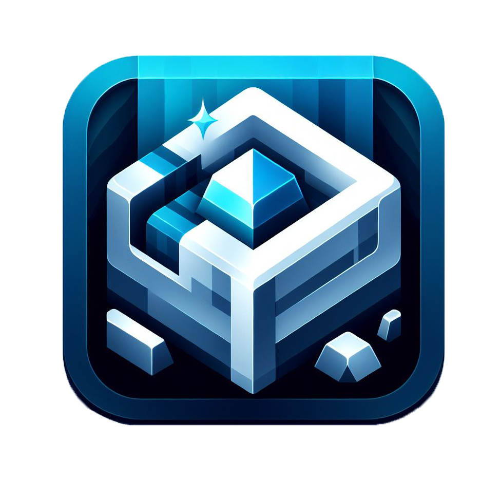

🌐
<a href="https://github.com/wen-wen520/Minecraft.Datapack-Ore_Plus">English</a>
&nbsp;|&nbsp;
<a href="https://github.com/wen-wen520/Minecraft.Datapack-Ore_Plus/blob/1.21.9/README.zh.md">中文</a>

<h1>
Ore Plus Datapack
</h1>

[![Discord Link](https://img.shields.io/badge/Join-passing?style=flat&label=Discord&labelColor=E1FFFE&color=E1FFFE&link=https%3A%2F%2Fdiscord.gg%2FVVPrbVj75t&logo=data:image/svg+xml;base64,PHN2ZyB3aWR0aD0iMjQiIGhlaWdodD0iMjQiIHZpZXdCb3g9IjAgMCAyNCAyNCIgZmlsbD0ibm9uZSIgeG1sbnM9Imh0dHA6Ly93d3cudzMub3JnLzIwMDAvc3ZnIj4KPHBhdGggZD0iTTEyIDJDMTcuNTIyOCAyIDIyIDYuNDc3MTUgMjIgMTJDMjIgMTcuNTIyOCAxNy41MjI4IDIyIDEyIDIyQzEwLjM4MTcgMjIgOC44MTc4MiAyMS42MTQ2IDcuNDEyODYgMjAuODg4TDMuNTg3MDQgMjEuOTU1M0MyLjkyMjEyIDIyLjE0MSAyLjIzMjU4IDIxLjc1MjUgMi4wNDY5MSAyMS4wODc2QzEuOTg1NDYgMjAuODY3NiAxLjk4NTQ5IDIwLjYzNDkgMi4wNDY5NSAyMC40MTUxTDMuMTE0NjEgMTYuNTkyMkMyLjM4NjM3IDE1LjE4NiAyIDEzLjYyMDMgMiAxMkMyIDYuNDc3MTUgNi40NzcxNSAyIDEyIDJaTTEyIDMuNUM3LjMwNTU4IDMuNSAzLjUgNy4zMDU1OCAzLjUgMTJDMy41IDEzLjQ2OTYgMy44NzI3NyAxNC44ODM0IDQuNTczMDMgMTYuMTM3NUw0LjcyMzY4IDE2LjQwNzJMMy42MTA5NiAyMC4zOTE0TDcuNTk3NTUgMTkuMjc5Mkw3Ljg2NzA5IDE5LjQyOTVDOS4xMjAwNiAyMC4xMjgxIDEwLjUzMjIgMjAuNSAxMiAyMC41QzE2LjY5NDQgMjAuNSAyMC41IDE2LjY5NDQgMjAuNSAxMkMyMC41IDcuMzA1NTggMTYuNjk0NCAzLjUgMTIgMy41Wk04Ljc1IDEzSDEzLjI0ODNDMTMuNjYyNSAxMyAxMy45OTgzIDEzLjMzNTggMTMuOTk4MyAxMy43NUMxMy45OTgzIDE0LjEyOTcgMTMuNzE2MSAxNC40NDM1IDEzLjM1IDE0LjQ5MzJMMTMuMjQ4MyAxNC41SDguNzVDOC4zMzU3OSAxNC41IDggMTQuMTY0MiA4IDEzLjc1QzggMTMuMzcwMyA4LjI4MjE1IDEzLjA1NjUgOC42NDgyMyAxMy4wMDY4TDguNzUgMTNIMTMuMjQ4M0g4Ljc1Wk04Ljc1IDkuNUgxNS4yNTQ1QzE1LjY2ODcgOS41IDE2LjAwNDUgOS44MzU3OSAxNi4wMDQ1IDEwLjI1QzE2LjAwNDUgMTAuNjI5NyAxNS43MjIzIDEwLjk0MzUgMTUuMzU2MyAxMC45OTMyTDE1LjI1NDUgMTFIOC43NUM4LjMzNTc5IDExIDggMTAuNjY0MiA4IDEwLjI1QzggOS44NzAzIDguMjgyMTUgOS41NTY1MSA4LjY0ODIzIDkuNTA2ODVMOC43NSA5LjVIMTUuMjU0NUg4Ljc1WiIgZmlsbD0iIzIxMjEyMSIvPgo8L3N2Zz4K)](https://discord.gg/VVPrbVj75t)

![Supported Game Versions](https://img.shields.io/badge/Minecraft-1.16.2--1.16.5_|_1.17.x_|_1.18.x_|_1.19.x_|_1.20.x_|_1.21.x-passing?style=flat&label=Minecraft&labelColor=E1FFFE&color=E1FFFE&link=https%3A%2F%2Fmodrinth.com%2Fdatapack%2Fore_plus%2Fversions&logo=data:image/svg+xml;base64,PHN2ZyB3aWR0aD0iMjQiIGhlaWdodD0iMjQiIHZpZXdCb3g9IjAgMCAyNCAyNCIgZmlsbD0ibm9uZSIgeG1sbnM9Imh0dHA6Ly93d3cudzMub3JnLzIwMDAvc3ZnIj4KPHBhdGggZD0iTTEwLjI1IDExQzkuODM1NzkgMTEgOS41IDExLjMzNTggOS41IDExLjc1QzkuNSAxMi4xNjQyIDkuODM1NzkgMTIuNSAxMC4yNSAxMi41SDEzLjc1QzE0LjE2NDIgMTIuNSAxNC41IDEyLjE2NDIgMTQuNSAxMS43NUMxNC41IDExLjMzNTggMTQuMTY0MiAxMSAxMy43NSAxMUgxMC4yNVpNMyA1LjI1QzMgNC4wMDczNiA0LjAwNzM2IDMgNS4yNSAzSDE4Ljc1QzE5Ljk5MjYgMyAyMSA0LjAwNzM2IDIxIDUuMjVWNi43NUMyMSA3LjUzMDEgMjAuNjAzIDguMjE3NDggMjAgOC42MjExMVYxNy4yNUMyMCAxOS4zMjExIDE4LjMyMTEgMjEgMTYuMjUgMjFINy43NUM1LjY3ODkzIDIxIDQgMTkuMzIxMSA0IDE3LjI1VjguNjIxMTFDMy4zOTcwMSA4LjIxNzQ4IDMgNy41MzAxIDMgNi43NVY1LjI1Wk01LjUgOVYxNy4yNUM1LjUgMTguNDkyNiA2LjUwNzM2IDE5LjUgNy43NSAxOS41SDE2LjI1QzE3LjQ5MjYgMTkuNSAxOC41IDE4LjQ5MjYgMTguNSAxNy4yNVY5SDUuNVpNNS4yNSA0LjVDNC44MzU3OSA0LjUgNC41IDQuODM1NzkgNC41IDUuMjVWNi43NUM0LjUgNy4xNjQyMSA0LjgzNTc5IDcuNSA1LjI1IDcuNUgxOC43NUMxOS4xNjQyIDcuNSAxOS41IDcuMTY0MjEgMTkuNSA2Ljc1VjUuMjVDMTkuNSA0LjgzNTc5IDE5LjE2NDIgNC41IDE4Ljc1IDQuNUg1LjI1WiIgZmlsbD0iIzIxMjEyMSIvPgo8L3N2Zz4K)

![Modrinth Version](https://img.shields.io/modrinth/v/EvMSt5OU?label=Latest%20Version&labelColor=E1FFFE&color=E1FFFE&link=https%3A%2F%2Fmodrinth.com%2Fdatapack%2Fore_plus%2Fversions&logo=data:image/svg+xml;base64,PHN2ZyB3aWR0aD0iMjQiIGhlaWdodD0iMjQiIHZpZXdCb3g9IjAgMCAyNCAyNCIgZmlsbD0ibm9uZSIgeG1sbnM9Imh0dHA6Ly93d3cudzMub3JnLzIwMDAvc3ZnIj4KPHBhdGggZD0iTTEyLjAwMDEgMS45OTgwNUMxNy41MjM4IDEuOTk4MDUgMjIuMDAxNiA2LjQ3NTg5IDIyLjAwMTYgMTEuOTk5NkMyMi4wMDE2IDE3LjUyMzMgMTcuNTIzOCAyMi4wMDExIDEyLjAwMDEgMjIuMDAxMUM2LjQ3NjM4IDIyLjAwMTEgMS45OTg1NCAxNy41MjMzIDEuOTk4NTQgMTEuOTk5NkMxLjk5ODU0IDYuNDc1ODkgNi40NzYzOCAxLjk5ODA1IDEyLjAwMDEgMS45OTgwNVpNMTIuMDAwMSAzLjQ5ODA1QzcuMzA0ODEgMy40OTgwNSAzLjQ5ODU0IDcuMzA0MzIgMy40OTg1NCAxMS45OTk2QzMuNDk4NTQgMTYuNjk0OSA3LjMwNDgxIDIwLjUwMTEgMTIuMDAwMSAyMC41MDExQzE2LjY5NTQgMjAuNTAxMSAyMC41MDE2IDE2LjY5NDkgMjAuNTAxNiAxMS45OTk2QzIwLjUwMTYgNy4zMDQzMiAxNi42OTU0IDMuNDk4MDUgMTIuMDAwMSAzLjQ5ODA1Wk0xMS45OTY0IDEwLjQ5ODZDMTIuMzc2MSAxMC40OTg0IDEyLjY5MDEgMTAuNzgwMyAxMi43NCAxMS4xNDY0TDEyLjc0NjkgMTEuMjQ4MUwxMi43NTA1IDE2Ljc0OTdDMTIuNzUwOCAxNy4xNjM5IDEyLjQxNTIgMTcuNSAxMi4wMDEgMTcuNTAwMkMxMS42MjEzIDE3LjUwMDUgMTEuMzA3MyAxNy4yMTg1IDExLjI1NzQgMTYuODUyNUwxMS4yNTA1IDE2Ljc1MDdMMTEuMjQ2OSAxMS4yNDkxQzExLjI0NjcgMTAuODM0OSAxMS41ODIyIDEwLjQ5ODkgMTEuOTk2NCAxMC40OTg2Wk0xMi4wMDA1IDcuMDAwODZDMTIuNTUyMSA3LjAwMDg2IDEyLjk5OTIgNy40NDc5OCAxMi45OTkyIDcuOTk5NTNDMTIuOTk5MiA4LjU1MTA3IDEyLjU1MjEgOC45OTgxOSAxMi4wMDA1IDguOTk4MTlDMTEuNDQ5IDguOTk4MTkgMTEuMDAxOSA4LjU1MTA3IDExLjAwMTkgNy45OTk1M0MxMS4wMDE5IDcuNDQ3OTggMTEuNDQ5IDcuMDAwODYgMTIuMDAwNSA3LjAwMDg2WiIgZmlsbD0iIzIxMjEyMSIvPgo8L3N2Zz4K)
![GitHub Release Date](https://img.shields.io/github/release-date/wen-wen520/Minecraft.Datapack-Ore_Plus?label=Latest%20Release%20Date&labelColor=E1FFFE&color=E1FFFE&link=https%3A%2F%2Fmodrinth.com%2Fdatapack%2Fore_plus%2Fversions&logo=data:image/svg+xml;base64,PHN2ZyB3aWR0aD0iMjQiIGhlaWdodD0iMjQiIHZpZXdCb3g9IjAgMCAyNCAyNCIgZmlsbD0ibm9uZSIgeG1sbnM9Imh0dHA6Ly93d3cudzMub3JnLzIwMDAvc3ZnIj4KPHBhdGggZD0iTTE3Ljc1IDNDMTkuNTQ0OSAzIDIxIDQuNDU1MDcgMjEgNi4yNVYxNy43NUMyMSAxOS41NDQ5IDE5LjU0NDkgMjEgMTcuNzUgMjFINi4yNUM0LjQ1NTA3IDIxIDMgMTkuNTQ0OSAzIDE3Ljc1VjYuMjVDMyA0LjQ1NTA3IDQuNDU1MDcgMyA2LjI1IDNIMTcuNzVaTTE5LjUgOC41SDQuNVYxNy43NUM0LjUgMTguNzE2NSA1LjI4MzUgMTkuNSA2LjI1IDE5LjVIMTcuNzVDMTguNzE2NSAxOS41IDE5LjUgMTguNzE2NSAxOS41IDE3Ljc1VjguNVpNNy43NSAxNC41QzguNDQwMzYgMTQuNSA5IDE1LjA1OTYgOSAxNS43NUM5IDE2LjQ0MDQgOC40NDAzNiAxNyA3Ljc1IDE3QzcuMDU5NjQgMTcgNi41IDE2LjQ0MDQgNi41IDE1Ljc1QzYuNSAxNS4wNTk2IDcuMDU5NjQgMTQuNSA3Ljc1IDE0LjVaTTEyIDE0LjVDMTIuNjkwNCAxNC41IDEzLjI1IDE1LjA1OTYgMTMuMjUgMTUuNzVDMTMuMjUgMTYuNDQwNCAxMi42OTA0IDE3IDEyIDE3QzExLjMwOTYgMTcgMTAuNzUgMTYuNDQwNCAxMC43NSAxNS43NUMxMC43NSAxNS4wNTk2IDExLjMwOTYgMTQuNSAxMiAxNC41Wk03Ljc1IDEwLjVDOC40NDAzNiAxMC41IDkgMTEuMDU5NiA5IDExLjc1QzkgMTIuNDQwNCA4LjQ0MDM2IDEzIDcuNzUgMTNDNy4wNTk2NCAxMyA2LjUgMTIuNDQwNCA2LjUgMTEuNzVDNi41IDExLjA1OTYgNy4wNTk2NCAxMC41IDcuNzUgMTAuNVpNMTIgMTAuNUMxMi42OTA0IDEwLjUgMTMuMjUgMTEuMDU5NiAxMy4yNSAxMS43NUMxMy4yNSAxMi40NDA0IDEyLjY5MDQgMTMgMTIgMTNDMTEuMzA5NiAxMyAxMC43NSAxMi40NDA0IDEwLjc1IDExLjc1QzEwLjc1IDExLjA1OTYgMTEuMzA5NiAxMC41IDEyIDEwLjVaTTE2LjI1IDEwLjVDMTYuOTQwNCAxMC41IDE3LjUgMTEuMDU5NiAxNy41IDExLjc1QzE3LjUgMTIuNDQwNCAxNi45NDA0IDEzIDE2LjI1IDEzQzE1LjU1OTYgMTMgMTUgMTIuNDQwNCAxNSAxMS43NUMxNSAxMS4wNTk2IDE1LjU1OTYgMTAuNSAxNi4yNSAxMC41Wk0xNy43NSA0LjVINi4yNUM1LjI4MzUgNC41IDQuNSA1LjI4MzUgNC41IDYuMjVWN0gxOS41VjYuMjVDMTkuNSA1LjI4MzUgMTguNzE2NSA0LjUgMTcuNzUgNC41WiIgZmlsbD0iIzIxMjEyMSIvPgo8L3N2Zz4K)

![Modrinth Downloads](https://img.shields.io/badge/dynamic/json?label=Downloads&query=downloads&url=https%3A%2F%2Fapi.modrinth.com%2Fv2%2Fproject%2FEvMSt5OU&style=flat&labelColor=E1FFFE&color=E1FFFE&link=https%3A%2F%2Fgithub.com%2Fwen-wen520%2FMinecraft.Datapack-Ore_Plus%2Fwiki%2FDownload-Table&logo=data:image/svg+xml;base64,PHN2ZyB3aWR0aD0iMjQiIGhlaWdodD0iMjQiIHZpZXdCb3g9IjAgMCAyNCAyNCIgZmlsbD0ibm9uZSIgeG1sbnM9Imh0dHA6Ly93d3cudzMub3JnLzIwMDAvc3ZnIj4KPHBhdGggZD0iTTEzIDNDMTMgMi40NDc3MiAxMi41NTIzIDIgMTIgMkMxMS40NDc3IDIgMTEgMi40NDc3MiAxMSAzVjE1LjA4NThMNy43MDcxMSAxMS43OTI5QzcuMzE2NTggMTEuNDAyNCA2LjY4MzQyIDExLjQwMjQgNi4yOTI4OSAxMS43OTI5QzUuOTAyMzcgMTIuMTgzNCA1LjkwMjM3IDEyLjgxNjYgNi4yOTI4OSAxMy4yMDcxTDExLjI5MjkgMTguMjA3MUMxMS42ODM0IDE4LjU5NzYgMTIuMzE2NiAxOC41OTc2IDEyLjcwNzEgMTguMjA3MUwxNy43MDcxIDEzLjIwNzFDMTguMDk3NiAxMi44MTY2IDE4LjA5NzYgMTIuMTgzNCAxNy43MDcxIDExLjc5MjlDMTcuMzE2NiAxMS40MDI0IDE2LjY4MzQgMTEuNDAyNCAxNi4yOTI5IDExLjc5MjlMMTMgMTUuMDg1OFYzWk01IDIwQzQuNDQ3NzIgMjAgNCAyMC40NDc3IDQgMjFDNCAyMS41NTIzIDQuNDQ3NzIgMjIgNSAyMkgxOUMxOS41NTIzIDIyIDIwIDIxLjU1MjMgMjAgMjFDMjAgMjAuNDQ3NyAxOS41NTIzIDIwIDE5IDIwSDVaIiBmaWxsPSIjMjEyMTIxIi8+Cjwvc3ZnPgo=)
![Modrinth Followers](https://img.shields.io/modrinth/followers/EvMSt5OU?style=flat&label=Followers&labelColor=E1FFFE&color=E1FFFE&link=https%3A%2F%2Fmodrinth.com%2Fdatapack%2Fore_plus&logo=data:image/svg+xml;base64,PHN2ZyB3aWR0aD0iMjQiIGhlaWdodD0iMjQiIHZpZXdCb3g9IjAgMCAyNCAyNCIgZmlsbD0ibm9uZSIgeG1sbnM9Imh0dHA6Ly93d3cudzMub3JnLzIwMDAvc3ZnIj4KPHBhdGggZD0iTTEyLjgxOTkgNS41NzkxMkwxMS45OTkyIDYuNDAxNjNMMTEuMTc1OSA1LjU3ODM4QzkuMDc2ODggMy40NzkzMSA1LjY3MzYxIDMuNDc5MzEgMy41NzQ1NSA1LjU3ODM4QzEuNDc1NDggNy42Nzc0NCAxLjQ3NTQ4IDExLjA4MDcgMy41NzQ1NSAxMy4xNzk4TDExLjQ2OTkgMjEuMDc1MUMxMS43NjI4IDIxLjM2OCAxMi4yMzc3IDIxLjM2OCAxMi41MzA2IDIxLjA3NTFMMjAuNDMyIDEzLjE3ODNDMjIuNTI2NCAxMS4wNzIzIDIyLjUzIDcuNjc4NTcgMjAuNDMwNiA1LjU3OTEyQzE4LjMyNzcgMy40NzYyMyAxNC45MjI4IDMuNDc2MjMgMTIuODE5OSA1LjU3OTEyWk0xOS4zNjg0IDEyLjEyMDZMMTIuMDAwMiAxOS40ODQyTDQuNjM1MjEgMTIuMTE5MUMzLjEyMTkyIDEwLjYwNTggMy4xMjE5MiA4LjE1MjMyIDQuNjM1MjEgNi42MzkwNEM2LjE0ODQ5IDUuMTI1NzUgOC42MDIgNS4xMjU3NSAxMC4xMTUzIDYuNjM5MDRMMTEuNDcyNyA3Ljk5NjQ4QzExLjc3MDYgOC4yOTQzNSAxMi4yNTUzIDguMjg4NTQgMTIuNTQ1OSA3Ljk4MzYzTDEzLjg4MDYgNi42Mzk3OEMxNS4zOTc3IDUuMTIyNjggMTcuODUyOCA1LjEyMjY4IDE5LjM2OTkgNi42Mzk3OEMyMC44ODM2IDguMTUzNDMgMjAuODgxIDEwLjU5OTcgMTkuMzY4NCAxMi4xMjA2WiIgZmlsbD0iIzIxMjEyMSIvPgo8L3N2Zz4K)

## 📋 Overview

This datapack modifies the default ore generation in Minecraft, primarily increasing the spawn rates of certain minerals.

Created with 💗 by wen_wen

## ❇️ Features

### No Mod Loaders Required: 
This datapack works seamlessly with vanilla Minecraft, requiring no additional mod loaders or software.

### Wide Compatibility: 
Designed to integrate smoothly with various Minecraft worlds and setups, ensuring minimal conflicts.

### Enhanced Ore Generation: 
Increases the spawn rates of specific minerals, making resource gathering more efficient.

## 🖼️ Gallery

[Modrinth Gallery](https://modrinth.com/datapack/ore_plus/gallery)

 

 

Only Ultra will modify the range of ore generation

## 📖 Detail

### Rate Table

The table below shows the modified ore generation probabilities after the datapack is applied. 

Please note that the names of the packs do not reflect the directly multiplied probabilities from the vanilla rates,\
but rather the extent to which the datapack modifies the original ore generation probabilities.

| Ore Type   | Ore Name        | Vanilla Rate | Datapack x2      | Datapack x4      | Datapack Ultra |
|:----------:|:---------------:|:------------:|:----------------:|:----------------:|:--------------:|
| Large      | Ancient Debris  | 1            | 8                | 16               | 256            |
| Lower      | Coal            | 20           | 40               | 80               | 256            |
| Upper      | Coal            | 30           | 54               | 100              | 256            |
| Ore        | Copper          | 16           | 26               | 48               | 256            |
| Large      | Copper          | 16           | 26               | 48               | 256            |
| Small      | Debris          | 1            | 8                | 16               | 256            |
| Ore        | Diamond         | 7            | 20               | 40               | 256            |
| Buried     | Diamond         | 4            | 12               | 24               | 256            |
| Large      | Diamond         | 9            | 24               | 48               | 256            |
| Ore        | Emerald         | 100          | 160              | 220              | 256            |
| Ore        | Gold            | 4            | 10               | 20               | 256            |
| Deltas     | Gold            | 20           | 35               | 80               | 256            |
| Extra      | Gold            | 50           | 90               | 200              | 256            |
| Lower      | Gold            | [0,1]        | [6,12]           | [18,24]          | 256            |
| Nether     | Gold            | 10           | 20               | 40               | 256            |
| Middle     | Iron            | 10           | 20               | 40               | 256            |
| Small      | Iron            | 10           | 20               | 40               | 256            |
| Upper      | Iron            | 90           | 140              | 200              | 256            |
| Ore        | Lapis           | 2            | 8                | 20               | 256            |
| Buried     | Lapis           | 4            | 12               | 32               | 256            |
| Deltas     | Quartz          | 32           | 56               | 100              | 256            |
| Nether     | Quartz          | 16           | 28               | 48               | 256            |
| Ore        | Redstone        | 4            | 10               | 22               | 256            |
| Lower      | Redstone        | 8            | 18               | 36               | 256            |

>[!Tip]
>Rates also listed on the download page on modrinth

Also please refer to [wiki](https://github.com/wen-wen520/Minecraft.Datapack-Ore_Plus/wiki) for more details, since the rate may adjust for different mc versions

## ✅ Installation and Versions

### Download Table (Recommende)

This table provides a convenient way to direct you to the download page,\
quickly find the right file without getting overwhelmed by the numerous available options.\
By using the **filters** function on Modrinth, you can choose either the datapack or mod from the following table to install in your Minecraft.

You will find **three editions of each version**, indicated by suffixes such as x2, x4, and ultra. 

- **x2** and **x4** are suitable for use in normal survival mode.
- The **ultra** edition offers enhanced features.

| Game Version       | Support | Download Datapack                                                                                  | Download Mod                                                                                     |
|--------------------|:-------:|------------------------------------------------------------------------------------------|-----------------------------------------------------------------------------------------|
| before 1.16.1      |    ❎    |                                                                                          |                                                                                         |
| 1.16.2 - 1.16.5    |    ✅    | [⬇️ Datapack](https://modrinth.com/datapack/ore_plus/versions?g=1.16.5&l=datapack)        | [⬇️ Mod](https://modrinth.com/datapack/ore_plus/versions?g=1.16.5&l=fabric)         |
| 1.17 - 1.17.1      |    ✅    | [⬇️ Datapack](https://modrinth.com/datapack/ore_plus/versions?g=1.17&l=datapack)         | [⬇️ Mod](https://modrinth.com/datapack/ore_plus/versions?g=1.17&l=fabric)          |
| 1.18 - 1.18.1      |    ✅    | [⬇️ Datapack](https://modrinth.com/datapack/ore_plus/versions?g=1.18.1&l=datapack)       | [⬇️ Mod](https://modrinth.com/datapack/ore_plus/versions?g=1.18.1&l=fabric)        |
| 1.18.2             |    ✅    | [⬇️ Datapack](https://modrinth.com/datapack/ore_plus/versions?g=1.18.2&l=datapack)       | [⬇️ Mod](https://modrinth.com/datapack/ore_plus/versions?g=1.18.2&l=fabric)        |
| 1.19 - 1.19.3      |    ✅    | [⬇️ Datapack](https://modrinth.com/datapack/ore_plus/versions?g=1.19.3&l=datapack)       | [⬇️ Mod](https://modrinth.com/datapack/ore_plus/versions?g=1.19.3&l=fabric)        |
| 1.19.4             |    ✅    | [⬇️ Datapack](https://modrinth.com/datapack/ore_plus/versions?g=1.19.4&l=datapack)       | [⬇️ Mod](https://modrinth.com/datapack/ore_plus/versions?g=1.19.4&l=fabric)        |
| 1.20 - 1.20.6      |    ✅    | [⬇️ Datapack](https://modrinth.com/datapack/ore_plus/versions?g=1.20.6&l=datapack)       | [⬇️ Mod](https://modrinth.com/datapack/ore_plus/versions?g=1.20.6&l=fabric)        |
| 1.21 - 1.21.8      |    ✅    | [⬇️ Datapack](https://modrinth.com/datapack/ore_plus/versions?g=1.21.8&l=datapack)       | [⬇️ Mod](https://modrinth.com/datapack/ore_plus/versions?g=1.21.8&l=fabric)        |
| 1.21.9 - 1.21.11   |    ✅    | [⬇️ Datapack](https://modrinth.com/datapack/ore_plus/versions?g=1.21.9&l=datapack)       | [⬇️ Mod](https://modrinth.com/datapack/ore_plus/versions?g=1.21.9&l=fabric)        |
| after 1.21.11       |    ❎    |        |         |

[More info](https://github.com/wen-wen520/Minecraft.Datapack-Ore_Plus/wiki/Download-Table)

### Other Download Source

Show

Modrinth [[⬇️ Download]](https://modrinth.com/datapack/ore_plus/versions) provides a modern UI to choose and download this datapack, Detailed rates also has been listed on download page

Github [[📦 Realse]](https://github.com/wen-wen520/Minecraft.Datapack-Ore_Plus/releases) Page is good to get the source code and pack them by self

Github [[🔧 Action]](https://github.com/wen-wen520/Minecraft.Datapack-Ore_Plus/actions) can be used to get the lasted dev build

### Install
Strongly recommand to install at the creation of a world

When creating a new world\
Find the **Data Paks** Option\
Click and drag the data pack to Minecraft\
Then move the data pack to the right hand side and click **Done**

[For detailed steps](https://minecraft.wiki/w/Tutorial:Installing_a_data_pack)

>[!Tip]
>Modrinth also provide auto [packed mod](https://modrinth.com/datapack/ore_plus/versions?l=fabric&l=forge&l=quilt&l=neoforge).

## ⚙️ Versions

![Supported Game Versions](https://img.shields.io/badge/Minecraft-1.16.2--1.16.5_|_1.17.x_|_1.18.x_|_1.19.x_|_1.20.x_|_1.21.x-passing?style=flat&label=Minecraft&labelColor=E1FFFE&color=E1FFFE&link=https%3A%2F%2Fmodrinth.com%2Fdatapack%2Fore_plus%2Fversions&logo=data:image/svg+xml;base64,PHN2ZyB3aWR0aD0iMjQiIGhlaWdodD0iMjQiIHZpZXdCb3g9IjAgMCAyNCAyNCIgZmlsbD0ibm9uZSIgeG1sbnM9Imh0dHA6Ly93d3cudzMub3JnLzIwMDAvc3ZnIj4KPHBhdGggZD0iTTEwLjI1IDExQzkuODM1NzkgMTEgOS41IDExLjMzNTggOS41IDExLjc1QzkuNSAxMi4xNjQyIDkuODM1NzkgMTIuNSAxMC4yNSAxMi41SDEzLjc1QzE0LjE2NDIgMTIuNSAxNC41IDEyLjE2NDIgMTQuNSAxMS43NUMxNC41IDExLjMzNTggMTQuMTY0MiAxMSAxMy43NSAxMUgxMC4yNVpNMyA1LjI1QzMgNC4wMDczNiA0LjAwNzM2IDMgNS4yNSAzSDE4Ljc1QzE5Ljk5MjYgMyAyMSA0LjAwNzM2IDIxIDUuMjVWNi43NUMyMSA3LjUzMDEgMjAuNjAzIDguMjE3NDggMjAgOC42MjExMVYxNy4yNUMyMCAxOS4zMjExIDE4LjMyMTEgMjEgMTYuMjUgMjFINy43NUM1LjY3ODkzIDIxIDQgMTkuMzIxMSA0IDE3LjI1VjguNjIxMTFDMy4zOTcwMSA4LjIxNzQ4IDMgNy41MzAxIDMgNi43NVY1LjI1Wk01LjUgOVYxNy4yNUM1LjUgMTguNDkyNiA2LjUwNzM2IDE5LjUgNy43NSAxOS41SDE2LjI1QzE3LjQ5MjYgMTkuNSAxOC41IDE4LjQ5MjYgMTguNSAxNy4yNVY5SDUuNVpNNS4yNSA0LjVDNC44MzU3OSA0LjUgNC41IDQuODM1NzkgNC41IDUuMjVWNi43NUM0LjUgNy4xNjQyMSA0LjgzNTc5IDcuNSA1LjI1IDcuNUgxOC43NUMxOS4xNjQyIDcuNSAxOS41IDcuMTY0MjEgMTkuNSA2Ljc1VjUuMjVDMTkuNSA0LjgzNTc5IDE5LjE2NDIgNC41IDE4Ljc1IDQuNUg1LjI1WiIgZmlsbD0iIzIxMjEyMSIvPgo8L3N2Zz4K)

![Modrinth Latest Version](https://img.shields.io/modrinth/v/EvMSt5OU?label=Latest%20Version&labelColor=E1FFFE&color=E1FFFE&link=https%3A%2F%2Fmodrinth.com%2Fdatapack%2Fore_plus%2Fversions&logo=data:image/svg+xml;base64,PHN2ZyB3aWR0aD0iMjQiIGhlaWdodD0iMjQiIHZpZXdCb3g9IjAgMCAyNCAyNCIgZmlsbD0ibm9uZSIgeG1sbnM9Imh0dHA6Ly93d3cudzMub3JnLzIwMDAvc3ZnIj4KPHBhdGggZD0iTTEyLjAwMDEgMS45OTgwNUMxNy41MjM4IDEuOTk4MDUgMjIuMDAxNiA2LjQ3NTg5IDIyLjAwMTYgMTEuOTk5NkMyMi4wMDE2IDE3LjUyMzMgMTcuNTIzOCAyMi4wMDExIDEyLjAwMDEgMjIuMDAxMUM2LjQ3NjM4IDIyLjAwMTEgMS45OTg1NCAxNy41MjMzIDEuOTk4NTQgMTEuOTk5NkMxLjk5ODU0IDYuNDc1ODkgNi40NzYzOCAxLjk5ODA1IDEyLjAwMDEgMS45OTgwNVpNMTIuMDAwMSAzLjQ5ODA1QzcuMzA0ODEgMy40OTgwNSAzLjQ5ODU0IDcuMzA0MzIgMy40OTg1NCAxMS45OTk2QzMuNDk4NTQgMTYuNjk0OSA3LjMwNDgxIDIwLjUwMTEgMTIuMDAwMSAyMC41MDExQzE2LjY5NTQgMjAuNTAxMSAyMC41MDE2IDE2LjY5NDkgMjAuNTAxNiAxMS45OTk2QzIwLjUwMTYgNy4zMDQzMiAxNi42OTU0IDMuNDk4MDUgMTIuMDAwMSAzLjQ5ODA1Wk0xMS45OTY0IDEwLjQ5ODZDMTIuMzc2MSAxMC40OTg0IDEyLjY5MDEgMTAuNzgwMyAxMi43NCAxMS4xNDY0TDEyLjc0NjkgMTEuMjQ4MUwxMi43NTA1IDE2Ljc0OTdDMTIuNzUwOCAxNy4xNjM5IDEyLjQxNTIgMTcuNSAxMi4wMDEgMTcuNTAwMkMxMS42MjEzIDE3LjUwMDUgMTEuMzA3MyAxNy4yMTg1IDExLjI1NzQgMTYuODUyNUwxMS4yNTA1IDE2Ljc1MDdMMTEuMjQ2OSAxMS4yNDkxQzExLjI0NjcgMTAuODM0OSAxMS41ODIyIDEwLjQ5ODkgMTEuOTk2NCAxMC40OTg2Wk0xMi4wMDA1IDcuMDAwODZDMTIuNTUyMSA3LjAwMDg2IDEyLjk5OTIgNy40NDc5OCAxMi45OTkyIDcuOTk5NTNDMTIuOTk5MiA4LjU1MTA3IDEyLjU1MjEgOC45OTgxOSAxMi4wMDA1IDguOTk4MTlDMTEuNDQ5IDguOTk4MTkgMTEuMDAxOSA4LjU1MTA3IDExLjAwMTkgNy45OTk1M0MxMS4wMDE5IDcuNDQ3OTggMTEuNDQ5IDcuMDAwODYgMTIuMDAwNSA3LjAwMDg2WiIgZmlsbD0iIzIxMjEyMSIvPgo8L3N2Zz4K)
![GitHub Latest Release Date](https://img.shields.io/github/release-date/wen-wen520/Minecraft.Datapack-Ore_Plus?label=Latest%20Release%20Date&labelColor=E1FFFE&color=E1FFFE&link=https%3A%2F%2Fmodrinth.com%2Fdatapack%2Fore_plus%2Fversions&logo=data:image/svg+xml;base64,PHN2ZyB3aWR0aD0iMjQiIGhlaWdodD0iMjQiIHZpZXdCb3g9IjAgMCAyNCAyNCIgZmlsbD0ibm9uZSIgeG1sbnM9Imh0dHA6Ly93d3cudzMub3JnLzIwMDAvc3ZnIj4KPHBhdGggZD0iTTE3Ljc1IDNDMTkuNTQ0OSAzIDIxIDQuNDU1MDcgMjEgNi4yNVYxNy43NUMyMSAxOS41NDQ5IDE5LjU0NDkgMjEgMTcuNzUgMjFINi4yNUM0LjQ1NTA3IDIxIDMgMTkuNTQ0OSAzIDE3Ljc1VjYuMjVDMyA0LjQ1NTA3IDQuNDU1MDcgMyA2LjI1IDNIMTcuNzVaTTE5LjUgOC41SDQuNVYxNy43NUM0LjUgMTguNzE2NSA1LjI4MzUgMTkuNSA2LjI1IDE5LjVIMTcuNzVDMTguNzE2NSAxOS41IDE5LjUgMTguNzE2NSAxOS41IDE3Ljc1VjguNVpNNy43NSAxNC41QzguNDQwMzYgMTQuNSA5IDE1LjA1OTYgOSAxNS43NUM5IDE2LjQ0MDQgOC40NDAzNiAxNyA3Ljc1IDE3QzcuMDU5NjQgMTcgNi41IDE2LjQ0MDQgNi41IDE1Ljc1QzYuNSAxNS4wNTk2IDcuMDU5NjQgMTQuNSA3Ljc1IDE0LjVaTTEyIDE0LjVDMTIuNjkwNCAxNC41IDEzLjI1IDE1LjA1OTYgMTMuMjUgMTUuNzVDMTMuMjUgMTYuNDQwNCAxMi42OTA0IDE3IDEyIDE3QzExLjMwOTYgMTcgMTAuNzUgMTYuNDQwNCAxMC43NSAxNS43NUMxMC43NSAxNS4wNTk2IDExLjMwOTYgMTQuNSAxMiAxNC41Wk03Ljc1IDEwLjVDOC40NDAzNiAxMC41IDkgMTEuMDU5NiA5IDExLjc1QzkgMTIuNDQwNCA4LjQ0MDM2IDEzIDcuNzUgMTNDNy4wNTk2NCAxMyA2LjUgMTIuNDQwNCA2LjUgMTEuNzVDNi41IDExLjA1OTYgNy4wNTk2NCAxMC41IDcuNzUgMTAuNVpNMTIgMTAuNUMxMi42OTA0IDEwLjUgMTMuMjUgMTEuMDU5NiAxMy4yNSAxMS43NUMxMy4yNSAxMi40NDA0IDEyLjY5MDQgMTMgMTIgMTNDMTEuMzA5NiAxMyAxMC43NSAxMi40NDA0IDEwLjc1IDExLjc1QzEwLjc1IDExLjA1OTYgMTEuMzA5NiAxMC41IDEyIDEwLjVaTTE2LjI1IDEwLjVDMTYuOTQwNCAxMC41IDE3LjUgMTEuMDU5NiAxNy41IDExLjc1QzE3LjUgMTIuNDQwNCAxNi45NDA0IDEzIDE2LjI1IDEzQzE1LjU1OTYgMTMgMTUgMTIuNDQwNCAxNSAxMS43NUMxNSAxMS4wNTk2IDE1LjU1OTYgMTAuNSAxNi4yNSAxMC41Wk0xNy43NSA0LjVINi4yNUM1LjI4MzUgNC41IDQuNSA1LjI4MzUgNC41IDYuMjVWN0gxOS41VjYuMjVDMTkuNSA1LjI4MzUgMTguNzE2NSA0LjUgMTcuNzUgNC41WiIgZmlsbD0iIzIxMjEyMSIvPgo8L3N2Zz4K)

Versions Info

### Supported

Minecraft: `1.21.9 - 1.21.11`\
Datapack Format: `88.0 - 94.1`\
**x2** **x4** and **Ultra** are [available ⬇️](https://modrinth.com/datapack/ore_plus/versions?g=1.21.9)

Minecraft: `1.21 - 1.21.8`\
Datapack Format: `48 - 81`\
**x2** **x4** and **Ultra** are [available ⬇️](https://modrinth.com/datapack/ore_plus/versions?g=1.21)

Minecraft: `1.20 - 1.20.6`\
Datapack Format: `15 - 41`\
**x2** **x4** and **Ultra** are [available ⬇️](https://modrinth.com/datapack/ore_plus/versions?g=1.20)

Minecraft: `1.19.4`\
Datapack Format: `12`\
**x2** **x4** and **Ultra** are [available ⬇️](https://modrinth.com/datapack/ore_plus/versions?g=1.19.4)

Minecraft: `1.19-1.19.3`\
Datapack Format: `10`\
**x2** **x4** and **Ultra** are [available ⬇️](https://modrinth.com/datapack/ore_plus/versions?g=1.19&g=1.19.1&g=1.19.2&g=1.19.3)

Minecraft: `1.18.2`\
Datapack Format: `9`\
**x2** **x4** and **Ultra** are [available ⬇️](https://modrinth.com/datapack/ore_plus/versions?g=1.18.2)

Minecraft: `1.18 - 1.18.1`\
Datapack Format: `8`\
**Limited Support[ℹ️](https://github.com/wen-wen520/Minecraft.Datapack-Ore_Plus/wiki/For-mc1.18)**\
**x2** **x4** and **Ultra** are [available ⬇️](https://modrinth.com/datapack/ore_plus/versions?g=1.18&g=1.18.1)

Minecraft: `1.17 - 1.17.1`\
Datapack Format: `7`\
**x2** **x4** and **Ultra** are [available ⬇️](https://modrinth.com/datapack/ore_plus/versions?g=1.17&g=1.17.1)

Minecraft: `1.16.2 -1.16.5`\
Datapack Format: `6`\
**x2** **x4** and **Ultra** are [available ⬇️](https://modrinth.com/datapack/ore_plus/versions?g=1.16.2&g=1.16.3&g=1.16.4&g=1.16.5)

### Will Support

mc `26.1` are on the way here (TBD)

### Not Support

below `1.16.1` (Included)\
The key part to modify ore pre generated `worldgen` has not been introduced to datapack

## 📃 Feeadbacks

Welcome to [📑Issue Page](https://github.com/wen-wen520/Minecraft.Datapack-Ore_Plus/issues/new/choose) to submit any bugs or featuers.

## 📜 License

## 🎉 Thanks & Related Resource

![Modrinth Follows](https://img.shields.io/modrinth/followers/EvMSt5OU?style=flat&label=Follows&labelColor=E1FFFE&color=E1FFFE&link=https%3A%2F%2Fmodrinth.com%2Fdatapack%2Fore_plus&logo=data:image/svg+xml;base64,PHN2ZyB3aWR0aD0iMjQiIGhlaWdodD0iMjQiIHZpZXdCb3g9IjAgMCAyNCAyNCIgZmlsbD0ibm9uZSIgeG1sbnM9Imh0dHA6Ly93d3cudzMub3JnLzIwMDAvc3ZnIj4KPHBhdGggZD0iTTEyLjgxOTkgNS41NzkxMkwxMS45OTkyIDYuNDAxNjNMMTEuMTc1OSA1LjU3ODM4QzkuMDc2ODggMy40NzkzMSA1LjY3MzYxIDMuNDc5MzEgMy41NzQ1NSA1LjU3ODM4QzEuNDc1NDggNy42Nzc0NCAxLjQ3NTQ4IDExLjA4MDcgMy41NzQ1NSAxMy4xNzk4TDExLjQ2OTkgMjEuMDc1MUMxMS43NjI4IDIxLjM2OCAxMi4yMzc3IDIxLjM2OCAxMi41MzA2IDIxLjA3NTFMMjAuNDMyIDEzLjE3ODNDMjIuNTI2NCAxMS4wNzIzIDIyLjUzIDcuNjc4NTcgMjAuNDMwNiA1LjU3OTEyQzE4LjMyNzcgMy40NzYyMyAxNC45MjI4IDMuNDc2MjMgMTIuODE5OSA1LjU3OTEyWk0xOS4zNjg0IDEyLjEyMDZMMTIuMDAwMiAxOS40ODQyTDQuNjM1MjEgMTIuMTE5MUMzLjEyMTkyIDEwLjYwNTggMy4xMjE5MiA4LjE1MjMyIDQuNjM1MjEgNi42MzkwNEM2LjE0ODQ5IDUuMTI1NzUgOC42MDIgNS4xMjU3NSAxMC4xMTUzIDYuNjM5MDRMMTEuNDcyNyA3Ljk5NjQ4QzExLjc3MDYgOC4yOTQzNSAxMi4yNTUzIDguMjg4NTQgMTIuNTQ1OSA3Ljk4MzYzTDEzLjg4MDYgNi42Mzk3OEMxNS4zOTc3IDUuMTIyNjggMTcuODUyOCA1LjEyMjY4IDE5LjM2OTkgNi42Mzk3OEMyMC44ODM2IDguMTUzNDMgMjAuODgxIDEwLjU5OTcgMTkuMzY4NCAxMi4xMjA2WiIgZmlsbD0iIzIxMjEyMSIvPgo8L3N2Zz4K)

I am really thanks everyone who follow or star this project,\
and of course, those people who download, use and love this project are also appreciate

Following resources are really helpful and useful,\
thanks for their contributions

[Minecraft](https://www.minecraft.net/)\
Provide the vanilla game (:

[Minecraft Wiki](https://minecraft.wiki/)\
Resource, Guide and Infomations

[Misode](https://github.com/misode/misode.github.io)\
Povide easy ways to create some files

[Spyglass](https://github.com/SpyglassMC/Spyglass)\
The best extension on VS Code for Minecraft Datapack

[Minecraft Title Generator](https://github.com/ewanhowell5195/MinecraftTitleGenerator)\
Use for screenshot in this project

[Xray Ultimate Resource Pack](https://www.curseforge.com/minecraft/texture-packs/xray-ultimate-1-11-compatible)\
Can exactly show the ores underground, used in gallery