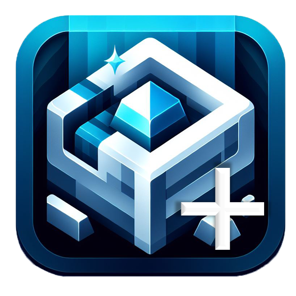

<h1>
Ore Plus Datapack
</h1>

    

## 📋 Overview

This datapack modifies the default ore generation in Minecraft, primarily increasing the spawn rates of certain minerals.

## ❇️ Features

### No Mod Loaders Required: 
This datapack works seamlessly with vanilla Minecraft, requiring no additional mod loaders or software.

### Wide Compatibility: 
Designed to integrate smoothly with various Minecraft worlds and setups, ensuring minimal conflicts.

### Enhanced Ore Generation: 
Increases the spawn rates of specific minerals, making resource gathering more efficient.

###

## ✅ Installation

### Download
Go to the realse page to [⬇️Download](https://github.com/wen-wen520/Minecraft.Datapack-Ore_Plus/releases)

### Install
Strongly recommand to install at the creation of a world

[🔗 For detailed steps](https://minecraft.wiki/w/Tutorial:Installing_a_data_pack)

## 📃 Feeadbacks

Go to Issue page to submit issues

## 📜 License

## 🔗 Related Resource

[Minecraft](https://www.minecraft.net/)

